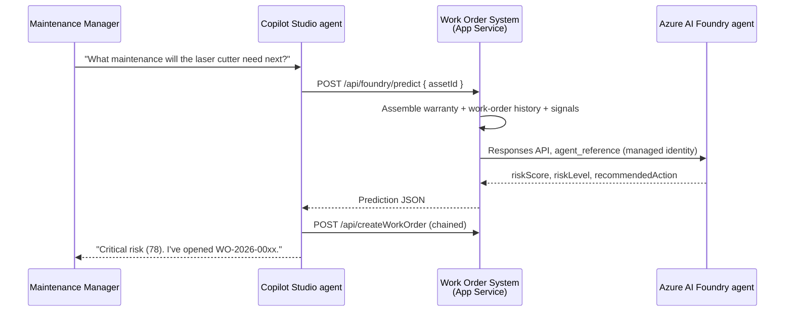

# Demo Guide (Run of Show)

## AI Solution Accelerator — 10 Minute Demo

This guide is the presenter script for the demo described in [demo_proposal.md](./demo_proposal.md). It assumes the environment is already configured per [setup_guide.md](./setup_guide.md): equipment documents split across **SharePoint** (Word) and **Azure AI Search** (PDF) and connected to a **Copilot Studio** agent, and the **Work Order & Warranty System** ([../workorder-system](../workorder-system)) already deployed to Azure App Service.

---

## Pre-demo checklist

- [ ] Copilot Studio agent (**Contoso Maintenance Assistant**) is published and responding.
- [ ] SharePoint knowledge source returns results (Word documents indexed).
- [ ] Azure AI Search index (`equipment-index`) indexer status is **Success** (PDF documents indexed).
- [ ] **Work Order & Warranty System is deployed** and the dashboard (`webAppUrl`) loads; `GET {apiBaseUrl}/health` returns `ok`.
- [ ] Web search is disabled on the agent so answers come from the documents.
- [ ] VS Code open with the repo and GitHub Copilot enabled (for the "extend with code" step).
- [ ] Azure subscription signed in for redeploying the Work Order & Warranty System.
- [ ] Work order dashboard open in a browser tab to show live updates.
- [ ] **Azure AI Foundry agent (Predictive Maintenance Insights) deployed** and `GET {apiBaseUrl}/health` returns `"foundryConfigured": true` (for the predictive step). See [setup_guide.md](./setup_guide.md) Part G.
- [ ] **Copilot Cowork plugin (Contoso Equipment Insights) installed and enabled** (for the deck-generation finale). See [setup_guide.md](./setup_guide.md) Part E.
- [ ] Test pane pre-loaded with one warm-up question.

---

## Run of show

### 1. Business challenge (1 min)
Set the scene: a maintenance manager at Contoso Electronics needs an assistant that can both **answer equipment questions** and **take action** (warranty checks, work orders).

### 2. Build the agent — knowledge Q&A (2 min)
- Open the agent in Copilot Studio; show the two connected knowledge sources.
- Ask a question answered by **SharePoint** (Word docs) and one answered by **Azure AI Search** (PDF docs) to prove both are working.

### 3. Extend the agent with code (3 min)
- Switch to VS Code (this repo is open). The two endpoints — `checkWarranty` (`GET /api/checkWarranty`) and `createWorkOrder` (`POST /api/createWorkOrder`) — already exist in the Work Order & Warranty System; walk through them, then have **GitHub Copilot generate the OpenAPI connector spec live**.
- The app is already deployed; redeploy only if you edit the routes.
- **Use the exact prompts and commands in [Building, deploying & connecting the Azure Functions](#building-deploying--connecting-the-azure-functions) below.**

### 4. Connect the new capability (2 min)
- Add the two operations as **tools/actions** in Copilot Studio (see the same section below).
- Show the agent picking them up immediately.

### 5. End-to-end experience (2 min)
- Ask a question that needs **both** knowledge and the new action (e.g., look up an equipment issue and create a work order).
- The agent reasons over the documents, calls the operation (which writes to the deployed system), and returns an actionable answer.
- Switch to the **work order dashboard** to show the new work order appear live.

### 6. Predictive intelligence with Azure AI Foundry (2 min)
- Ask the agent to **predict** which maintenance an asset needs next. Copilot Studio calls `predictMaintenance`, the App Service calls the **Azure AI Foundry** agent, and a risk score plus recommended action comes back.
- Then say "open that work order" — the agent chains the Foundry recommendation straight into `createWorkOrder`.
- **Three Microsoft AI surfaces in one sentence:** Foundry reasons, GitHub Copilot built the contract, Copilot Studio orchestrates. Script: [Adding predictive maintenance with Azure AI Foundry](#adding-predictive-maintenance-with-azure-ai-foundry).

### 7. (Optional finale) Generate a deck with Copilot Cowork (1 min)
- Switch to **Copilot Cowork** and prompt it to build an equipment status PowerPoint.
- The **Contoso Equipment Insights** plugin pulls live data from the same system and produces a deck — see [Generating a PowerPoint with Copilot Cowork](#generating-a-powerpoint-with-copilot-cowork).

---

## Building, deploying & connecting the Azure Functions

This is the detailed script for demo steps 3 and 4. It creates **two HTTP-triggered Azure Functions** that act as the bridge between the Copilot Studio agent and the deployed Work Order & Warranty System:

| Function | Method | Calls the system | Purpose |
|----------|--------|------------------|---------|
| `checkWarranty` | GET | `GET {WORKORDER_API_BASE}/equipment/{assetId}/warranty` | Check an asset's warranty status. |
| `createWorkOrder` | POST | `POST {WORKORDER_API_BASE}/workorders` | Create a work order for an asset. |

> **Note on hosting.** This subscription's governance policy blocks public network access and shared-key auth on new storage accounts, so a Consumption-plan Azure Function App can't be provisioned. Instead, the two operations are exposed as routes (`/api/checkWarranty`, `/api/createWorkOrder`) on the **already-deployed Work Order & Warranty System** App Service. The code-first "extend the agent" story is unchanged — you still write the handlers with Copilot and redeploy — there is just no separate Function App to manage.

**Prerequisites for this step**
- Azure CLI (`az`) installed and signed in.
- The **`webAppName`** / **`apiBaseUrl`** from Part C of [setup_guide.md](./setup_guide.md) (e.g. `https://app-contosowo-xxxx.azurewebsites.net/api`).

### Step A — Show the code, then build the connector spec live with GitHub Copilot

The two endpoints already exist in [../workorder-system/server.js](../workorder-system/server.js) — open the file and walk the audience through them (they reuse `store.getWarranty` and `store.createWorkOrder`):

- **`checkWarranty`** — `GET /api/checkWarranty?assetId=...` (HTTP 400 if `assetId` is missing, 404 if unknown).
- **`createWorkOrder`** — `POST /api/createWorkOrder` with a JSON body (`assetId`, `title`, `priority`, `description`, `requestedBy`); HTTP 400 if `assetId`/`title` missing, 201 on success.

**Now build the connector spec live.** Open Copilot Chat (agent mode) and run this single prompt — this is the on-stage "watch Copilot build it" moment:

> Look at the `GET /api/checkWarranty` and `POST /api/createWorkOrder` routes in `workorder-system/server.js` and the data shapes returned by `workorder-system/lib/store.js`. Generate an **OpenAPI 2.0 (Swagger)** file named `workorder-system/openapi.json` describing both endpoints, with `host` set to `app-contosowo-mvjskqas3y4lo.azurewebsites.net`, `basePath` `/api`, request/response schemas, and example responses, so it can be imported as a custom connector in Copilot Studio. Make the schema strict enough for the Power Apps custom connector to import without type-mismatch errors: give every integer property an explicit `"format": "int32"` (e.g. `daysRemaining`), use `"format": "date-time"` for ISO timestamps (`checkedAt`, `createdAt`, `updatedAt`) and `"format": "date"` for date-only fields (`installDate`, `warrantyExpiry`), and mark nullable properties (e.g. `assignedTo`) with `"x-nullable": true`.

> Presenter fallback: a known-good copy is saved as `workorder-system/openapi.reference.json`. If the live generation misbehaves, copy it over `workorder-system/openapi.json` and continue.

> Tip: Verify locally before deploying — run `npm start` in the `workorder-system` folder and call `http://localhost:3000/api/checkWarranty?assetId=CE-OSC-1200`.

### Step B — Redeploy the Work Order & Warranty System

The `checkWarranty` and `createWorkOrder` operations are routes on the existing App Service, so there is **no Function App to provision** — just redeploy the app with the new code.

```powershell
# From the workorder-system folder (reuses the App Service from Part C)
cd workorder-system
az webapp up `
  --name app-contosowo-mvjskqas3y4lo `
  --resource-group rg-contoso-workorders `
  --runtime "NODE:22-lts"
```

Smoke-test the two endpoints (replace the host with your `webAppUrl`):

```powershell
# Warranty check
curl "https://<webAppName>.azurewebsites.net/api/checkWarranty?assetId=CE-OSC-1200"

# Create a work order
curl -X POST "https://<webAppName>.azurewebsites.net/api/createWorkOrder" `
  -H "Content-Type: application/json" `
  -d '{"assetId":"CE-LAS-3300","title":"Laser cutter needs service","priority":"High"}'
```

### Step C — Add the operations as tools in Copilot Studio

**Recommended: import the OpenAPI file as a custom connector**

1. In [Copilot Studio](https://copilotstudio.microsoft.com), open your **Contoso Maintenance Assistant** agent.
2. Go to **Tools** (or **Actions**) → **Add a tool** → **New tool** → **Custom connector**. This opens Power Apps custom connectors.
3. Choose **New custom connector** → **Import an OpenAPI file** and upload `workorder-system/openapi.json`.
4. On **General**, set **Host** to `<webAppName>.azurewebsites.net` and **Base URL** to `/api`.
5. On **Security**, choose **No authentication** (the App Service API is open by default; if you set `API_KEY` on the app, choose **API Key**, parameter name `x-api-key`, location **Header** instead).
6. On **Definition**, confirm the two operations (`checkWarranty`, `createWorkOrder`) and their parameters; give each a clear **Summary/Description**.
7. **Create connector**, then **Test** it (no key needed unless `API_KEY` is set on the app).
8. Back in Copilot Studio, on the agent select **Add a tool**, pick your custom connector, and add both operations.

**Alternative: add each operation as a REST API / HTTP action**

1. On the agent, **Add a tool** → **REST API** (or **Add an action** → **Create new**).
2. Provide the method and URL, e.g. `GET https://<webAppName>.azurewebsites.net/api/checkWarranty`.
3. If you set `API_KEY` on the app, add it as an `x-api-key` header; otherwise no auth is needed.
4. Define inputs (`assetId` for warranty; `assetId`, `title`, `priority`, `description`, `requestedBy` for work orders) and the JSON output.
5. Repeat for `createWorkOrder` (POST with a JSON body).

**For either approach — make the agent invoke the tools reliably**

- Give each tool a clear **description**, e.g.:
  - `checkWarranty`: "Checks the warranty status of a piece of equipment by its asset ID (e.g., CE-OSC-1200). Returns whether it is under warranty and days remaining."
  - `createWorkOrder`: "Creates a maintenance work order for a piece of equipment. Requires the asset ID and a short title; accepts priority and description."
- Describe each **input parameter** so the orchestrator maps user intent to arguments.
- **Save** and **Publish** the agent.

### Step D — Verify end to end

In the **Test** pane, run the Section D questions below (e.g., "Is CE-OSC-1200 under warranty?" and "Create a work order for the laser cutter"). Confirm the agent calls the operations and that new work orders appear on the dashboard.

---

## Adding predictive maintenance with Azure AI Foundry

This is the detailed script for run-of-show step 6 — the moment where **Azure AI Foundry**, **GitHub Copilot**, and **Copilot Studio** are visibly working together in a single user turn.

| Surface | What it does here |
|---------|-------------------|
| **Azure AI Foundry** (Agent Service) | The **Predictive Maintenance Insights** agent reasons over the asset's warranty status and recent work-order history and returns a risk score + recommended action. |
| **GitHub Copilot** | Generates the OpenAPI operation (`predictMaintenance`) that exposes it — same live-coding move as `checkWarranty` / `createWorkOrder`. |
| **Copilot Studio** | Calls the operation as a tool, then chains the recommendation into `createWorkOrder`. |

The Foundry agent is called **server-side** by the Work Order & Warranty System, not directly by Copilot Studio. Worth saying out loud: the prompt payload is assembled from the system of record (not from the chat transcript), authentication is a **managed identity** rather than a key in the connector, and there is a deterministic fallback if Foundry is unreachable.



**Prerequisite:** the Foundry project and agent are deployed and wired to the App Service per [setup_guide.md](./setup_guide.md) Part G / [../foundry-agent/README.md](../foundry-agent/README.md).

### Step A — Show the endpoint, then extend the connector spec with GitHub Copilot

Open [../workorder-system/lib/foundry.js](../workorder-system/lib/foundry.js) and walk the audience through the three things it does — this is a 30-second read, not a code review:

1. **Assembles the evidence** — pulls the asset, computed warranty, and recent work orders from the same store the other two operations use, then engineers signals (age in years, work orders in the last 90/365 days, open and high/critical counts, mean days between failures).
2. **Calls Foundry** — posts the payload to the agent through the Responses API (`agent_reference` + managed-identity token) and parses its JSON.
3. **Validates and clamps** the model's output before returning it, falling back to a deterministic score if Foundry is unavailable (`"source": "local-heuristic"`).

Then run this prompt in Copilot Chat (agent mode) to extend the spec you generated in the previous step:

> Look at the `POST /api/foundry/predict` route in `workorder-system/server.js` and the response shape built in `workorder-system/lib/foundry.js`. Add a `predictMaintenance` operation for it to the existing `workorder-system/openapi.json` (OpenAPI 2.0 / Swagger, `basePath` `/api`, so the path is `/foundry/predict`). Include the request body schema (`assetId` required, optional `historyLimit` and `workOrderHistory`) and a full response schema covering `riskScore`, `riskLevel`, `confidence`, `recommendedAction`, `recommendedPriority`, `recommendedWithinDays`, `rationale`, `riskFactors`, `signals`, and `source`. Keep it strict enough for the Power Apps custom connector to import: explicit `"format": "int32"` on every integer, `"format": "date-time"` on ISO timestamps, `enum` values for `riskLevel`, `recommendedPriority`, and `source`, and `"x-nullable": true` on nullable properties. Add a `description` on the operation that tells the Copilot Studio orchestrator to call it when the user asks about failure risk, predicted maintenance, or what service an asset needs next.

> Presenter fallback: the known-good copy in `workorder-system/openapi.reference.json` already contains `predictMaintenance`. Copy it over `workorder-system/openapi.json` if the live generation misbehaves.

### Step B — Deploy and smoke-test

Redeploy only if you changed the routes — the endpoint ships with the app:

```powershell
cd workorder-system
az webapp up `
  --name app-contosowo-mvjskqas3y4lo `
  --resource-group rg-contoso-workorders `
  --runtime "NODE:22-lts"
```

Confirm Foundry is wired up, then call the endpoint:

```powershell
# Should return foundryConfigured : True
Invoke-RestMethod "https://<webAppName>.azurewebsites.net/api/health"

Invoke-RestMethod -Method POST "https://<webAppName>.azurewebsites.net/api/foundry/predict" `
  -ContentType "application/json" `
  -Body '{ "assetId": "CE-LAS-3300" }'
```

Expect `riskScore`, `riskLevel`, `recommendedAction`, `suggestedWorkOrderTitle`, and `"source": "azure-ai-foundry"`.

> If `source` comes back as `local-heuristic`, the App Service could not reach Foundry — check `FOUNDRY_PROJECT_ENDPOINT` / `FOUNDRY_AGENT_NAME` and that the Web App's managed identity has the **Foundry User** role. The demo still runs; the answer just isn't coming from Foundry.

### Step C — Add `predictMaintenance` as a tool in Copilot Studio

Same path as the other two operations:

1. If you imported the custom connector already, **re-import** the updated `openapi.json` (in Power Apps: your connector → **Edit** → **Swagger Editor** / **Update from OpenAPI file**) so `predictMaintenance` appears, then **Update connector**.
2. Back in Copilot Studio, open the agent → **Add a tool** → your custom connector → add **predictMaintenance**.
3. Give it an orchestrator-friendly **description**:
   - *"Predicts equipment failure risk. Given an asset ID (e.g., CE-LAS-3300), returns a risk score from 0-100, a risk level, the reasons behind it, and a recommended maintenance action. Use it whenever the user asks what maintenance an asset needs next, how likely it is to fail, or which equipment to prioritise."*
4. Describe the **`assetId`** input so the orchestrator maps the equipment name in the question to the right ID.
5. **Save** and **Publish**.

> To make the chaining reliable, add one line to the agent's instructions: *"When `predictMaintenance` returns a risk level of High or Critical and the user agrees to act, call `createWorkOrder` using `suggestedWorkOrderTitle` as the title and `recommendedPriority` as the priority."* The response is deliberately shaped so those fields drop straight into `createWorkOrder`.

### Step D — Run it live

In the **Test** pane:

| Question | What the audience sees |
|----------|------------------------|
| "What maintenance will the CO2 laser cutter (CE-LAS-3300) need next?" | Copilot Studio → `predictMaintenance` → Foundry. A **Critical** risk score with reasons drawn from real work-order history. |
| "Why is the risk that high?" | The agent reads back `riskFactors` and `rationale` — every factor cites a real count or date, not a hallucination. |
| "OK, open that work order." | Chains into `createWorkOrder` using `suggestedWorkOrderTitle` / `recommendedPriority`; the ticket appears on the dashboard. |
| "Rank the SMT line equipment by failure risk." | Multiple `predictMaintenance` calls in one turn, ranked in the answer. |
| "Is the oscilloscope (CE-OSC-1200) at risk?" | The contrast case — **Low** risk, "keep it on the routine schedule", and warranty still Active. |

**The line to land it:** *"Azure AI Foundry did the reasoning, GitHub Copilot wrote the contract that exposed it, and Copilot Studio orchestrated the whole thing — same equipment data, same source of truth, three Microsoft AI surfaces in one sentence from the user."*

### Presenter tips

- Expand the tool-call trace in the Test pane so the audience sees `predictMaintenance` fire and the JSON come back — the risk score landing in the answer is much more convincing than the prose alone.
- Ask "why?" as a follow-up. Grounded `riskFactors` are the antidote to "isn't this just the model guessing?"
- Run the **CE-LAS-3300 (Critical)** and **CE-OSC-1200 (Low)** cases back to back. The contrast proves the score reflects the data, not a canned answer.
- First call after an idle App Service can be slow (F1 has no Always On). Warm it up with a health check before you start.

---

## (Optional extension) Adding Dataverse business data

Use this if you want a talk track that shows the agent **combining data from two sources in a single answer**: the live **Work Order & Warranty System** API (operational truth — warranty, work orders) **and** a **Dataverse** table holding the business context a customer typically already has (vendors, service contracts, SLA, cost). Keying both on the same `AssetId` lets the agent join them.

> **Prerequisite:** the **Equipment Service Contract** Dataverse table is created and loaded per [setup_guide.md](./setup_guide.md) Part F.

> **Why this lands.** The equipment API deliberately does **not** know about renewal cost, service vendor, or SLA. So a question like *"The laser cutter is out of warranty — who's our service vendor, what's the renewal cost, and what's their SLA?"* forces the agent to call the **API** (warranty status) **and** **Dataverse** (vendor, cost, SLA) and merge the result — a clean "one agent, many systems" moment.

### Connect it in Copilot Studio (done live)

1. Open your **Contoso Maintenance Assistant** agent → **Tools** → **Add a tool**.
2. Choose the **Microsoft Dataverse** connector and the action **List rows** (or **Get a row by ID / alternate key**) against the **Equipment Service Contract** table.
3. Give it a clear description so the orchestrator knows when to call it, e.g.: *"Looks up the service contract, vendor, SLA response time, and renewal cost for a piece of equipment by its asset ID (e.g., CE-LAS-3300)."*
4. Add `AssetId` as the input parameter and describe it.
5. **Save** and **Publish** the agent.

### Cross-source questions (API + Dataverse)

Run these in the **Test** pane to show both sources being combined:

| Question | What the agent combines |
|----------|-------------------------|
| "The CO2 laser cutter (CE-LAS-3300) is out of warranty — who's our service vendor, what's the renewal cost, and what's their SLA?" | **API** warranty status + **Dataverse** vendor, `RenewalCost`, `SlaResponseHours`. |
| "The wave soldering machine (CE-WAV-2600) failed. Is it under warranty, and if not, what would a renewal cost and who do we call?" | **API** warranty (Expired) + **Dataverse** vendor + `RenewalCost` + `VendorContactEmail`. |
| "Create a High priority work order for the laser cutter and tell me the vendor SLA so I know the response time." | **API** create work order + **Dataverse** `SlaResponseHours` + `VendorName`. |
| "Which of our expired-warranty machines has the highest annual downtime cost, and what's the renewal cost to cover it?" | **API** warranty status across assets + **Dataverse** `AnnualDowntimeCostEstimate` + `RenewalCost`. |

> Presenter tip: pair this with the dashboard — warranty/work-order data matches the API, while the vendor/cost/SLA figures come only from Dataverse, making the "two systems, one answer" point obvious.

---

## Generating a PowerPoint with Copilot Cowork

This is the optional finale (run-of-show step 7). It shows the **same** Work Order & Warranty System data being turned into a polished artifact by **Copilot Cowork** using the **Contoso Equipment Insights** plugin ([../cowork-plugin](../cowork-plugin)).

**Prerequisite:** the plugin is installed and enabled per [setup_guide.md](./setup_guide.md) Part E, and its connector points at your deployed system's `/mcp` endpoint.

### Steps

1. Open **Copilot Cowork**.
2. Go to **Sources & Skills → Plugins** and confirm **Contoso Equipment Insights** is enabled.
3. Enter one of the prompts below. Cowork triggers the `generate-equipment-deck` skill, calls the connector tools (`get_summary`, `list_equipment`, `list_work_orders`, ...) to pull **live** data, and builds the deck.
4. Show the generated PowerPoint \u2014 point out that the asset IDs, warranty statuses, and work orders match the dashboard and the agent's answers (single source of truth).

### Prompts to use

| Prompt | Result |
|--------|--------|
| "Create a PowerPoint deck summarizing our equipment warranty status and open work orders." | Full-fleet status deck (title, executive summary, inventory, warranty, attention-needed, work orders, recommendations). |
| "Generate an equipment status presentation and highlight anything out of warranty." | Deck emphasizing expired/expiring assets (e.g., CE-LAS-3300, CE-WAV-2600, CE-SOL-0450). |
| "Build a slide deck of all open and critical work orders by equipment." | Work-order-focused deck grouped by priority. |
| "Make a warranty summary deck for our test & measurement equipment." | Category-scoped deck (oscilloscope, function generator, multimeter, power supply). |

### Presenter tips

- Keep the **work order dashboard** visible alongside the generated deck so the audience sees the data match.
- If you created a new work order during step 5, ask Cowork to regenerate the deck to show it now includes that work order \u2014 reinforcing "one system, many surfaces".
- If the deck lacks real data, verify the plugin connector `mcpServerUrl` and that the system's `/mcp` endpoint is reachable.

---

## Sample questions

Ask these in the Test pane or published channel. Each maps to a document so you get grounded, high-quality answers. The **Source** column shows which knowledge source answers it.

### A. Answered by SharePoint (Word documents)

| Question | Expected answer highlights | Source |
|----------|----------------------------|--------|
| What is the temperature range of the soldering station? | 100 °C – 450 °C, ±2 °C stability (CE-SOL-0450) | SharePoint |
| The soldering station shows error E-04. What does it mean? | Heating element open circuit — replace the cartridge | SharePoint |
| How many heating zones does the reflow oven have? | 8 top + 8 bottom zones (CE-RFO-2100) | SharePoint |
| What causes cold solder joints on the reflow oven? | Verify profile peak temperature and time-above-liquidus | SharePoint |
| What temperature and humidity range does the environmental test chamber support? | −70 °C to +180 °C; 10%–98% RH (CE-ETC-3100) | SharePoint |
| How do I fix a humidity error on the environmental chamber? | Refill water reservoir, clean wick, verify sensor | SharePoint |
| What coating types does the conformal coating machine support? | Acrylic, silicone, urethane (CE-CCM-2800) | SharePoint |
| What is the alignment accuracy of the solder paste stencil printer? | ±12.5 µm @ 6σ (CE-SPP-2000) | SharePoint |
| What are the outputs of the programmable DC power supply? | Triple output: 2× 0–30 V/5 A and 1× 0–6 V/3 A (CE-PSU-1400) | SharePoint |
| How do I reduce false calls on the AOI system? | Retune thresholds, clean optics, verify lighting calibration | SharePoint |

### B. Answered by Azure AI Search (PDF documents)

| Question | Expected answer highlights | Source |
|----------|----------------------------|--------|
| What is the bandwidth of the digital oscilloscope? | 1 GHz, 4 channels, 5 GSa/s sample rate (CE-OSC-1200) | Azure AI Search |
| The oscilloscope self-calibration fails. What should I do? | 20-minute warm-up, disconnect all inputs, retry calibration | Azure AI Search |
| What materials must never be cut on the laser cutter? | Never cut PVC or chlorinated plastics; only approved materials | Azure AI Search |
| What is the laser cutter's work area and power? | 1300 × 900 mm, 150 W sealed CO2 (CE-LAS-3300) | Azure AI Search |
| What is the placement accuracy of the pick and place machine? | ±25 µm @ 3σ; up to 45,000 CPH (CE-PNP-2200) | Azure AI Search |
| Why is the wave soldering machine producing excessive dross? | Reduce wave turbulence; verify nitrogen if equipped | Azure AI Search |
| What modulation types does the function generator support? | AM, FM, PM, FSK, PWM, sweep, burst (CE-FGN-1300) | Azure AI Search |
| The bench multimeter shows no current reading. What's wrong? | Check the current-input fuse and that the lead is in the correct jack | Azure AI Search |
| What safety rules apply to the X-ray inspection system? | Ionizing radiation — never bypass interlocks; trained operators only; wear dosimeter | Azure AI Search |
| How do I clear an ESD wrist strap monitor alarm? | Check strap fit and cord; replace worn strap or cord (CE-ESD-0100) | Azure AI Search |

### C. Cross-source / reasoning questions (hit both sources)

| Question | Why it's a good demo question |
|----------|-------------------------------|
| List the safety precautions for all our soldering-related equipment. | Combines soldering station (SharePoint) + wave soldering (Azure AI Search). |
| Which pieces of test & measurement equipment do we have and what are their key specs? | Pulls oscilloscope, function generator, multimeter (Azure AI Search) + power supply (SharePoint). |
| Compare the reflow oven and the wave soldering machine — when do we use each? | Reflow (SharePoint) vs wave (Azure AI Search). |
| What maintenance is due monthly across our SMT line equipment? | Aggregates stencil printer, AOI (SharePoint) + pick-and-place (Azure AI Search). |

### D. Action questions (backed by the deployed Work Order & Warranty System)

Use these after the connector tools are connected. The agent calls the deployed system, so warranty answers and work orders are **real** and visible on the dashboard.

> Given the current date, some assets are intentionally **out of warranty** — great for showing the "expired → create work order" flow: CO2 Laser Cutter (CE-LAS-3300), Wave Soldering Machine (CE-WAV-2600), and Soldering Station (CE-SOL-0450). Assets like the Oscilloscope (CE-OSC-1200) and X-Ray System (CE-XRI-3400) are still **under warranty**.

| Question | Capability demonstrated |
|----------|-------------------------|
| Is the digital oscilloscope (CE-OSC-1200) still under warranty? | Warranty check — returns **Active** with days remaining. |
| Is the CO2 laser cutter (CE-LAS-3300) under warranty? | Warranty check — returns **Expired**. |
| The laser cutter (CE-LAS-3300) needs service — create a work order. | Work order creation; appears on the dashboard. |
| The soldering station keeps throwing error E-04. Look up the fix and open a maintenance work order for it. | End-to-end: knowledge retrieval + work order creation. |
| Check the warranty on the wave soldering machine (CE-WAV-2600) and, if expired, create a work order to renew the service contract. | Reasoning + conditional action against the live system. |
| Show me the open work orders for the laser cutter. | Work order lookup (`GET /workorders?assetId=CE-LAS-3300`). |

### E. Predictive questions (backed by the Azure AI Foundry agent)

Use these once `predictMaintenance` is connected. Each one round-trips through **Azure AI Foundry**, so the reasoning is generated live from the asset's real history.

| Question | Capability demonstrated |
|----------|-------------------------|
| What maintenance will the CO2 laser cutter (CE-LAS-3300) need next? | Foundry risk score + recommended action for a high-risk, out-of-warranty asset. |
| Is the digital oscilloscope (CE-OSC-1200) at risk of failing? | The contrast case — **Low** risk, routine schedule, warranty still Active. |
| Why is the laser cutter's risk score that high? | Reads back `riskFactors` and `rationale`, each citing a real count or date. |
| Which of our SMT line machines should we service first? | Multiple `predictMaintenance` calls ranked in a single answer. |
| Predict the risk on the wave soldering machine (CE-WAV-2600) and open a work order if it's High or Critical. | Foundry prediction chained into `createWorkOrder` using `suggestedWorkOrderTitle` and `recommendedPriority`. |
| The soldering station threw error E-04 twice this week — what's the failure risk? | Knowledge retrieval (SharePoint) + Foundry prediction in one turn. |

---

## Presenter tips

- Start with one **SharePoint** and one **Azure AI Search** question back-to-back to prove both sources work.
- Keep questions specific (include the equipment name or asset ID) for the cleanest, grounded answers.
- If an answer looks generic, confirm web search is disabled and the knowledge sources are healthy.
- Keep the **work order dashboard** visible so the audience sees work orders appear live when the agent creates them.
- Before the predictive step, check `GET {apiBaseUrl}/health` shows `"foundryConfigured": true` — it also warms up the App Service.
- Save the **action questions** for the finale so the payoff (knowledge + custom capability) lands last.
