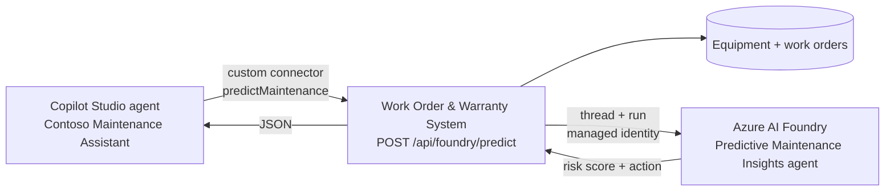

# Contoso Electronics — Predictive Maintenance Insights (Azure AI Foundry)

An **Azure AI Foundry** project hosting a **Foundry Agent Service** agent called
**Predictive Maintenance Insights**. Given an `assetId`, it reasons over the
warranty status and recent work-order history held in the
[Work Order & Warranty System](../workorder-system) — the *same* equipment data
the Copilot Studio agent already uses — and returns a **risk score** plus a
**recommended maintenance action**.

This is the third pillar of the demo: **Azure AI Foundry** does the reasoning,
**GitHub Copilot** generates the OpenAPI spec that exposes it, and **Copilot
Studio** calls it live in front of the audience.



The agent is **not** called directly by Copilot Studio. The App Service owns the
call so that:

- the prompt payload is assembled from the system of record, not from the LLM's
  memory of the conversation;
- authentication is **Entra ID with a managed identity** — no keys in the
  connector;
- there is a deterministic fallback if Foundry is unreachable mid-demo.

---

## Project structure

```
foundry-agent/
├── agent/
│   ├── agent-definition.json   # Name, model settings, response format
│   ├── instructions.md         # The agent's system prompt (source-controlled)
│   ├── sample-request.json     # Example payload sent by the App Service
│   └── sample-response.json    # Example JSON the agent returns
├── infra/
│   ├── main.bicep              # Foundry resource + project + model deployment + RBAC
│   └── main.parameters.json
├── scripts/
│   ├── foundry-client.js       # Minimal REST client for the v2 agents API
│   ├── create-agent.js         # Creates/versions the agent from agent/
│   └── test-agent.js           # Smoke-tests the agent directly
├── package.json
└── README.md
```

### A note on the API surface

Foundry's **v2 agents API** replaced the legacy Assistants surface (`/assistants`
plus threads and runs) that the `@azure/ai-agents` SDK targets — that path now
returns `PermissionDenied` on new accounts. Agents are versioned "prompt agents"
under `/agents`, and they are invoked through the OpenAI **Responses** protocol:

| Operation | Call |
|-----------|------|
| Create agent | `POST {projectEndpoint}/agents?api-version=v1` with `{ name, description, definition }` |
| New version | `POST {projectEndpoint}/agents/{name}/versions?api-version=v1` |
| Invoke | `POST {projectEndpoint}/openai/v1/responses` with `{ agent_reference: { type: "agent_reference", name }, input }` |

There is no JavaScript SDK for this yet, so both this folder and
[../workorder-system/lib/foundry.js](../workorder-system/lib/foundry.js) call the
REST endpoints directly with an Entra token (scope `https://ai.azure.com/.default`).
Agents are referenced by **name**, not by an `asst_` ID.

---

## The contract

**Input** — assembled by [../workorder-system/lib/foundry.js](../workorder-system/lib/foundry.js)
from the live data store: asset details, computed warranty, engineered signals
(age, work-order counts by window, mean interval between failures), the recent
work-order history, and the deterministic baseline score.

**Output** — strict JSON:

| Field | Type | Meaning |
|-------|------|---------|
| `riskScore` | integer 0–100 | Failure risk. |
| `riskLevel` | `Low` / `Moderate` / `High` / `Critical` | Banded score. |
| `confidence` | 0.0–1.0 | Lower when history is thin. |
| `recommendedAction` | string | Imperative, asset-specific next step. |
| `recommendedPriority` | `Low` / `Medium` / `High` / `Critical` | Maps straight to `createWorkOrder`. |
| `recommendedWithinDays` | integer | Deadline for the action. |
| `rationale` | string | Cites the signals that drove the score. |
| `riskFactors` | array | 2–4 ranked factors with impact and detail. |
| `suggestedWorkOrderTitle` | string (≤60 chars) | Ready to pass to `createWorkOrder`. |

See [agent/sample-response.json](./agent/sample-response.json) for a full example.

The App Service validates and clamps every field before returning it, so a
malformed model response degrades to the baseline rather than breaking the
connector schema.

---

## Deploy

### 1. Provision the Foundry resource, project, and model

Deploy into the **same resource group** as the Work Order & Warranty System so
the whole demo tears down together.

```powershell
# From the repository root
az deployment group create `
  -g rg-contoso-workorders `
  -f foundry-agent/infra/main.bicep `
  -p foundry-agent/infra/main.parameters.json
```

Record the **`projectEndpoint`** output, e.g.
`https://aif-contosowo-xxxx.services.ai.azure.com/api/projects/proj-predictive-maintenance`.

> **Region.** The template defaults to `eastus`. The `location` parameter is
> restricted to regions that carry `gpt-4.1-mini`; the Foundry resource does
> **not** have to sit in the same region as the App Service.
>
> **Model version.** Azure refuses new deployments of models in a *deprecating*
> state (`ServiceModelDeprecating`). If the deployment fails with that error,
> list what is currently deployable and update `modelName` / `modelVersion` in
> [infra/main.parameters.json](./infra/main.parameters.json):
>
> ```powershell
> az cognitiveservices model list -l eastus `
>   --query "[?kind=='AIServices' && contains(model.name, 'mini')].{name:model.name, version:model.version}" -o table
> ```
>
> **Cost.** `GlobalStandard` is pay-as-you-go with no reserved capacity — the
> demo makes a handful of small calls, so the cost is negligible. There is no
> free tier for `AIServices`.
>
> **Local auth is disabled** (`disableLocalAuth: true`), so there are no API
> keys to leak. Everything authenticates through Entra ID.

### 2. Grant access to the agent

The Web App already has a system-assigned managed identity. Give it the
**Foundry User** role (role ID `53ca6127-db72-4b80-b1b0-d745d6d5456d`, formerly
named *Azure AI User*) on the Foundry resource by re-running the deployment with
its principal ID:

```powershell
$principalId = az webapp identity show `
  -g rg-contoso-workorders `
  -n <webAppName> `
  --query principalId -o tsv

az deployment group create `
  -g rg-contoso-workorders `
  -f foundry-agent/infra/main.bicep `
  -p foundry-agent/infra/main.parameters.json `
  -p webAppPrincipalId=$principalId
```

**Your own account needs the same role** to run `create-agent`. Assign it by role
ID, since the display name has changed:

```powershell
$me = az ad signed-in-user show --query id -o tsv
$scope = az cognitiveservices account show -g rg-contoso-workorders -n <foundryResourceName> --query id -o tsv
az role assignment create --assignee-object-id $me --assignee-principal-type User `
  --role "53ca6127-db72-4b80-b1b0-d745d6d5456d" --scope $scope
```

### 3. Create the agent

```powershell
cd foundry-agent
npm install
az login

$env:FOUNDRY_PROJECT_ENDPOINT = "<projectEndpoint from step 1>"
npm run create-agent
```

Re-running the script adds a **new version** of the same agent rather than
creating duplicates, so you can iterate on
[agent/instructions.md](./agent/instructions.md) and redeploy the prompt. The
`agent_endpoint` always resolves to `@latest`.

Smoke-test it against the sample payload without involving the App Service:

```powershell
npm run test-agent
```

### 4. Wire it into the Work Order & Warranty System

Either set the app settings directly:

```powershell
az webapp config appsettings set `
  -g rg-contoso-workorders `
  -n <webAppName> `
  --settings `
    FOUNDRY_PROJECT_ENDPOINT="<projectEndpoint>" `
    FOUNDRY_AGENT_NAME="predictive-maintenance-insights"
```

…or redeploy [../workorder-system/infra/main.bicep](../workorder-system/infra/main.bicep)
with the `foundryProjectEndpoint` and `foundryAgentName` parameters set (they are
already stubbed in `main.parameters.json`).

Verify:

```powershell
Invoke-RestMethod "https://<webAppName>.azurewebsites.net/api/health"
# -> foundryConfigured : True

Invoke-RestMethod -Method POST "https://<webAppName>.azurewebsites.net/api/foundry/predict" `
  -ContentType "application/json" `
  -Body '{ "assetId": "CE-LAS-3300" }'
# -> riskScore, riskLevel, recommendedAction, source: "azure-ai-foundry"
```
---

## App settings reference

| Setting | Required | Default | Purpose |
|---------|----------|---------|---------|
| `FOUNDRY_PROJECT_ENDPOINT` | Yes | — | Foundry project endpoint. |
| `FOUNDRY_AGENT_NAME` | Yes | — | Agent name, e.g. `predictive-maintenance-insights`. |
| `FOUNDRY_TIMEOUT_MS` | No | `45000` | Max wait for a response before falling back. |
| `FOUNDRY_FALLBACK` | No | on | Set to `off` to return HTTP 502 instead of the heuristic score. |

---

## Graceful degradation

If `FOUNDRY_PROJECT_ENDPOINT` / `FOUNDRY_AGENT_NAME` are unset, or the call fails
or times out, `POST /api/foundry/predict` still returns a well-formed prediction
using the deterministic scoring in
[../workorder-system/lib/foundry.js](../workorder-system/lib/foundry.js), with:

```json
{ "source": "local-heuristic", "fallbackReason": "..." }
```

Same schema, same connector, no dead end on stage. Check `source` in the
response to know which path answered.

---

## Teardown

Deleting the `rg-contoso-workorders` resource group removes the Foundry
resource, project, and model deployment along with the App Service. To remove
just the agent, delete it from the **Agents** blade of the Foundry portal.
